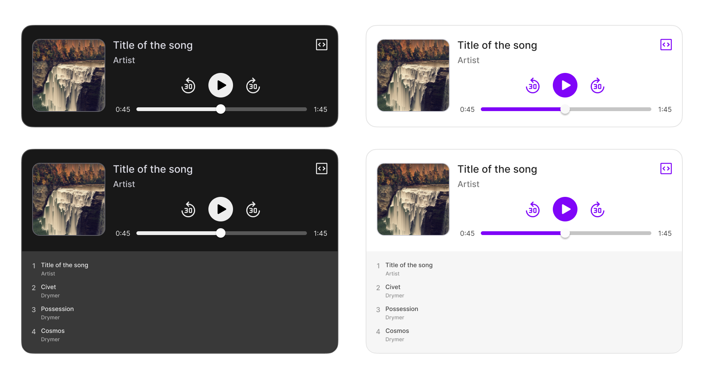

# Sonic Embed

- Music player for liver coders who want to share their code alongside their music.
- Based on [HTMLMediaElement](https://developer.mozilla.org/en-US/docs/Web/API/HTMLMediaElement).
- Supports MP3, WAV, and OGG on most browsers (for more info, see [Media container formats](https://developer.mozilla.org/en-US/docs/Web/Media/Formats/Containers)).
- Automatic light/dark mode based on user's system preferences.

## Installation & Development

1. Clone the repository
2. Install NPM packages in the project directory by running `npm install`
3. Run `npm run dev` and open [http://localhost:5173](http://localhost:5173) to view it in the browser.

## Getting Started

Import the `AudioPlayer` component to your project. It accepts two props:

- `src`: an array of track objects with the following properties:
  - src (url of the audio file)
  - title
  - artist
  - artwork
  - code
- `showArtwork` (boolean, `false` by default)

If there is more than one track, a playlist will be displayed.

```jsx
// Sample taken from Sonic Pi's documentation
const code = `
use_synth :hollow
with_fx :reverb, mix: 0.7 do
  live_loop :note1 do
    play choose([:D4,:E4]), attack: 6, release: 6
    sleep 8
  end
  live_loop :note2 do
    play choose([:Fs4,:G4]), attack: 4, release: 5
    sleep 10
  end
  live_loop :note3 do
    play choose([:A4, :Cs5]), attack: 5, release: 5
    sleep 11
  end
end
`;

const data = [
  {
    title: "Sample beat",
    artist: "Darin Wilson",
    src: exampleTrack,
    code: code,
  },
];

function App() {
  return <AudioPlayer data={data} />;
}

export default App;
```
